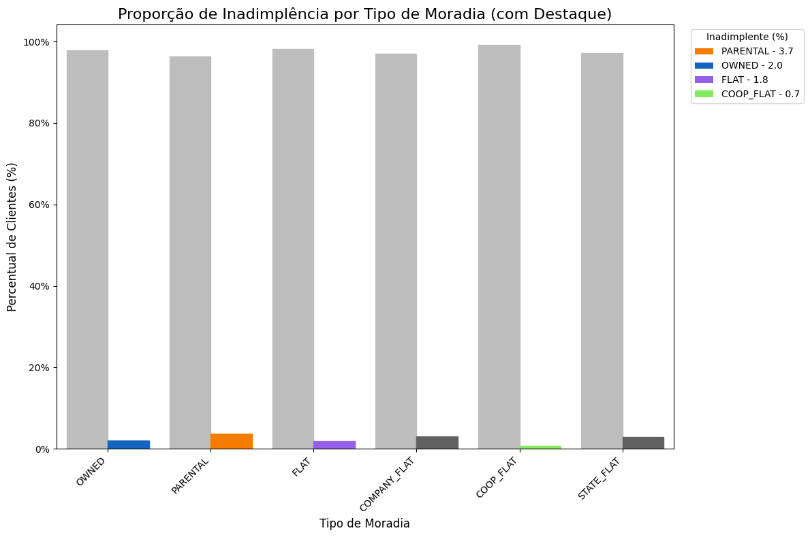
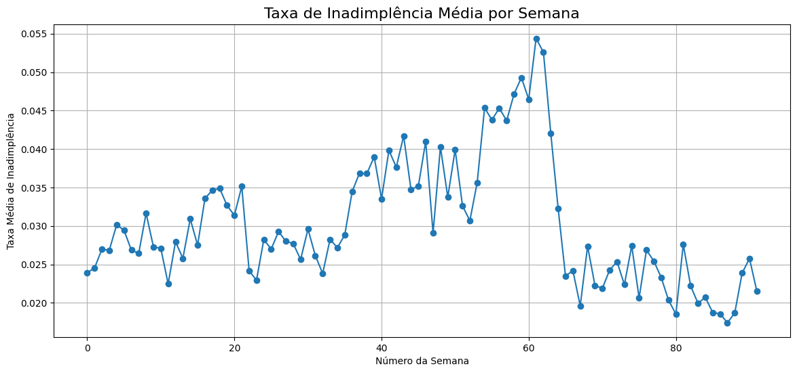
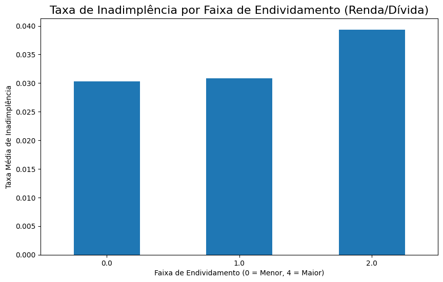

  <h1 align="center">Análise de Risco de Crédito</h1>

  
  
  
  
  

  Case técnico de ciência de dados focado na construção de um modelo de risco de crédito para prever a inadimplência de clientes, visando a otimização de processos e a redução de perdas financeiras para uma instituição de crédito ao consumidor.

---

### Tópicos

- [1. Contexto de Negócio](#contexto-de-negócio)
- [2. O Dataset](#o-dataset)
- [3. Ferramentas Utilizadas](#ferramentas-utilizadas)
- [4. Metodologia](#metodologia)
- [5. Análise Exploratória e Insights](#análise-exploratória-e-insights)
- [6. Modelagem e Performance](#modelagem-e-performance)
- [7. Recomendações de Negócio](#recomendações-de-negócio)
- [8. Autor](#autor)

---

### 1. Contexto de Negócio
Uma instituição financeira especializada em crédito ao consumidor nos contratou com o objetivo de **aprimorar seu processo de avaliação de risco de crédito**. O desafio principal é desenvolver uma solução baseada em dados que identifique com precisão os clientes com maior probabilidade de inadimplência, permitindo que a empresa tome decisões mais inteligentes para **reduzir prejuízos** e otimizar a concessão de crédito.

O cenário é desafiador, pois a base de clientes geral apresenta um baixo risco, com uma **taxa de inadimplência de apenas 3.2%**. O sucesso do projeto reside em encontrar essa "agulha no palheiro" sem impactar negativamente a aprovação de bons clientes.

### 2. O Dataset
Para este desafio, utilizamos uma base de dados pública da competição **Home Credit - Credit Risk Model Stability**, disponível no Kaggle. O dataset simula um ambiente real, com dados distribuídos em múltiplas tabelas que incluem informações cadastrais, socioeconômicas, histórico de crédito e detalhes de aplicações anteriores.

- **Fonte:** [Kaggle Competition](https://www.kaggle.com/competitions/home-credit-credit-risk-model-stability/overview)

### 3. Ferramentas Utilizadas
- **Linguagem:** Python 3.11
- **Análise e Manipulação de Dados:** Polars, Pandas, NumPy
- **Visualização de Dados:** Matplotlib, Seaborn
- **Machine Learning e Modelagem:** Scikit-learn, LightGBM
- **Ambiente de Desenvolvimento:** Jupyter Notebook

### 4. Metodologia
O projeto foi estruturado em um pipeline de ponta a ponta, focado em eficiência e boas práticas:
1.  **Preparação de Dados:** Utilização da biblioteca **Polars** para manipulação de grandes volumes de dados, garantindo alta performance. Todos os arquivos de dados foram carregados e preparados.
2.  **Engenharia de Features:** Criação de variáveis agregadas a partir de tabelas de histórico para resumir o comportamento financeiro do cliente.
3.  **Análise Exploratória (EDA):** Investigação dos dados para extrair insights, entender a distribuição das variáveis e a relação com a inadimplência (`target`).
4.  **Pré-processamento e Modelagem:** Construção de um pipeline robusto com **Scikit-learn** para tratar dados ausentes, aplicar encoding em variáveis categóricas e escalar os dados numéricos.
5.  **Treinamento e Otimização:** Treinamento de um modelo de Gradient Boosting (**LightGBM**), otimização de seus parâmetros para lidar com o desbalanceamento de classes e ajuste do limiar de decisão para maximizar o equilíbrio entre Precision e Recall.

### 5. Análise Exploratória e Insights
A análise dos dados revelou padrões importantes sobre o perfil de risco dos clientes.

#### **Insight 1: Perfil de Moradia como Indicador de Risco**
O tipo de moradia do cliente tem uma forte correlação com a taxa de inadimplência. Clientes que residem com os pais (**Parental**) apresentam um risco quase **duas vezes maior** que clientes com casa própria (**Owned**).

#### **Insight 2: Análise Temporal**
Pode haver variações no risco ou no volume de crédito ao longo das semanas, talvez relacionadas a ciclos econômicos ou datas comemorativas.

#### **Insight 3: Relação Dívida/Renda**
A razão entre a dívida atual e a renda principal do cliente é um forte indicador de risco. Clientes na faixa mais alta de endividamento proporcional apresentaram uma taxa de inadimplência significativamente maior.

### 6. Modelagem e Performance
O modelo final (`LGBMClassifier`) foi otimizado para equilibrar a detecção de clientes de risco (Recall) e a precisão dos alertas (Precision), resultando em uma performance robusta e com grande aplicabilidade de negócio.

| Métrica                 | Valor  | Interpretação de Negócio                                                                   |
| ----------------------- | ------ | ------------------------------------------------------------------------------------------ |
| **AUC-ROC** | 0.75   | Boa capacidade geral do modelo de distinguir entre clientes bons e ruins.                  |
| **Recall (Classe 1)** | 0.23   | O modelo consegue identificar **23%** de todos os clientes que se tornariam inadimplentes.      |
| **Precision (Classe 1)**| 0.13   | Quando o modelo sinaliza um cliente como "alto risco", ele está correto em **13%** das vezes. |
| **F1-Score (Classe 1)** | 0.17   | Melhor equilíbrio geral alcançado entre Precision e Recall.                                 |

### 7. Recomendações de Negócio
Com base nos resultados, as seguintes ações são recomendadas:

- **Recomendação 1 (Processo):** Implementar o modelo no fluxo de aprovação de crédito. Solicitações que receberem um score de risco acima do limiar otimizado devem ser **automaticamente encaminhadas para uma análise manual complementar**, otimizando o tempo da equipe de especialistas.
- **Recomendação 2 (Política de Crédito):** Criar **políticas de crédito diferenciadas** para os segmentos de maior risco identificados (ex: clientes com alto índice Dívida/Renda), podendo ajustar limites ou solicitar garantias adicionais.
- **Recomendação 3 (Alerta Crítico):** Tratar qualquer registro de **atraso grave no passado como um alerta vermelho prioritário**, exigindo uma análise sênior obrigatória antes de qualquer concessão de novo crédito.

### 8. Autor
Desenvolvido por **Raphael Pimentel**.

- **LinkedIn:** [https://www.linkedin.com/in/raphaelcmpimentel/](https://www.linkedin.com/in/raphaelcmpimentel/)
- **E-mail:** [raphaelmpimentel@hotmail.com](mailto:raphaelmpimentel@hotmail.com)
